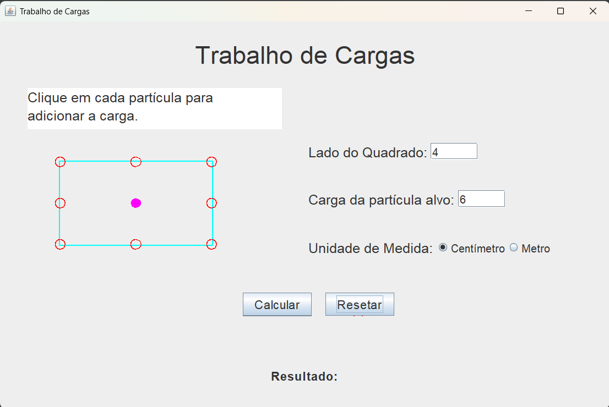

# 🧮 Trabalha de Cargas

Um projeto realizado em JAVA com interface gráfica que calcula uma situação física.

Nesta situação temos no máximo 8 partículas em forma de um quadrado e temos que mover uma partícula alvo para o centro deste quadradro. O projeto calcula a quantidade de trabalho necessário para realizar isto.

---

## 📸 Preview da interface

---

## 🚀 Funcionalidades

- ✅ Interface gráfica (Swing)
- ✅ Validação de entrada
- ✅ Calculo de carga
- ✅ Erros tratados com mensagens

---

## Baixe o executável (jar) aqui
OBS: É necessário ter o JDK intalado, <a href="https://download.oracle.com/java/24/latest/jdk-24_windows-x64_bin.exe">clique aqui para instalar</a>.

Executável: 